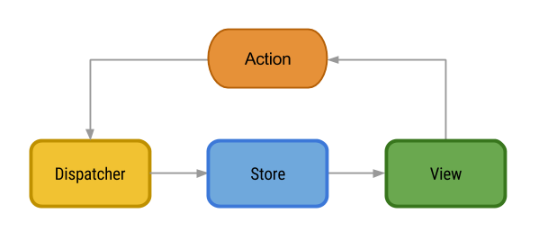

#### Fluxo da arquitetura Flux para frontend



- npm install

#### Servidor de Teste
- npm install -g @treinaweb/tw-dev-server
- Dentro do projeto: tw-dev-server
- Abrir: https://treinaweb.github.io/tw-dev-server/
  - Criar endpoint (method POST): react-flux/todo
  - Objeto:
    ```JSON
      {
        "description": "Fazer testes automatizados",
        "isChecked": false
      }
    ```

- npm start